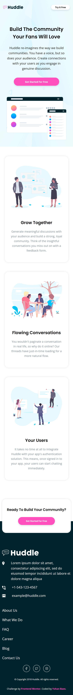
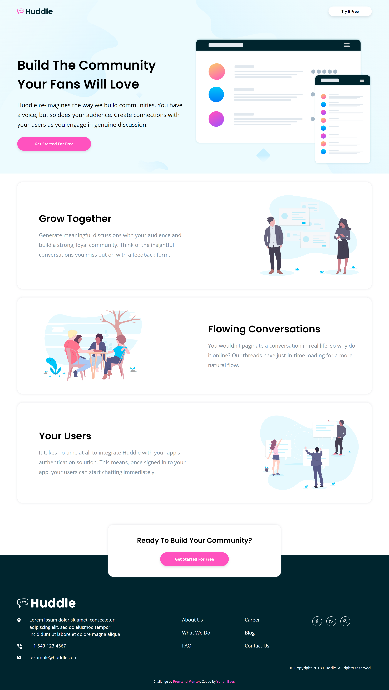

# Frontend Mentor - Huddle landing page with alternating feature blocks

This is a solution to the [Huddle landing page with alternating feature blocks challenge on Frontend Mentor](https://www.frontendmentor.io/challenges/huddle-landing-page-with-alternating-feature-blocks-5ca5f5981e82137ec91a5100).

## The challenge

Your challenge is to build out this page and get it looking as close to the design as possible.

## Screenshot

### Mobile Screenshot

### Desktop Screenshot

## Links

- Solution URL: https://www.frontendmentor.io/solutions/alternative-huddle-landing-page-responsive-mobile-first--xIdhU7HKk
- Live Site URL: https://raink31.github.io/016-Huddle-Landing-Page-2/

## Built with

- HTML5
- CSS
- Flexbox
- CSS Grid
- Mobile First Workflow

## Author

- Frontend Mentor - https://www.frontendmentor.io/profile/Raink31
